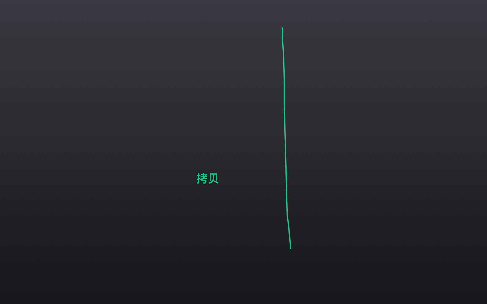
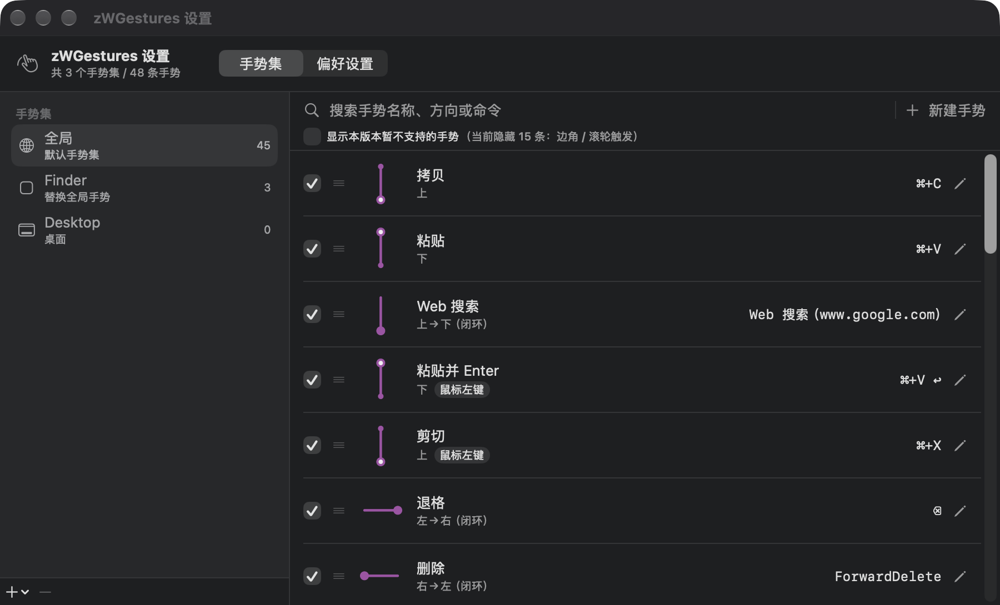
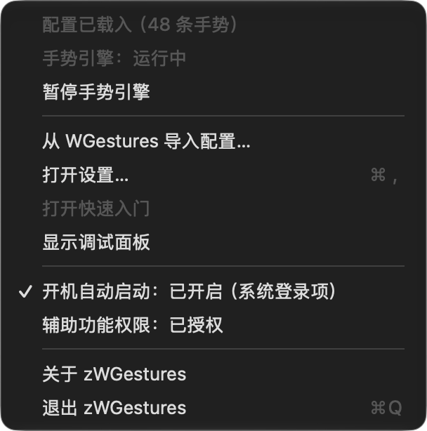

# zWGestures

[](https://github.com/ZilongYang/zWGestures/actions/workflows/ci.yml)
[](LICENSE)


**A native Apple Silicon mouse-gesture tool.** Hold the right mouse button, draw a shape, and the
action you configured for it runs.

Written from scratch in Swift with no Rosetta dependency. It is compatible with the configuration
file format of [WGestures 2](https://www.yingdev.com/projects/wgestures2), so your existing gestures
can be imported directly (see [Why zWGestures exists](#why-zwgestures-exists)).

> **Just want to download and use it?** See [`docs/INSTALL.md`](docs/INSTALL.md) (in Chinese) — an
> unsigned app has to be allowed through once, and that file spells out every step, the exact system
> wording, and how each conclusion was actually measured.

> 中文文档见 [`README.md`](README.md)。**The app's interface is currently Chinese-only** — see
> [Known limitations](#known-limitations).



<details>
<summary><b>Screenshots</b> (settings / menu bar)</summary>





> Two notes: the dark background behind the trail is a **backdrop** — the trail and the gesture name
> themselves are captured live (see [`docs/ROADMAP.md`](docs/ROADMAP.md) §18, in Chinese). And the
> screenshots show the **factory-default gestures that ship with the app**, i.e. what you get after
> downloading it, not this machine's own configuration.

</details>

## Features

- **Right-button gestures of any shape.** Not just up/down/left/right — arbitrary polylines,
  circles and L-shapes are recognised, matched by normalised shape distance.
- **A gesture = a stroke + the action it fires.** Actions can be key sequences (including recorded
  modifier combinations and multi-step sequences), system function keys, a web-search URL or a
  shell script; a gesture can also be set to run the instant it is recognised.
- **Per-application gesture sets, with inheritance.** An application's own gestures win; anything it
  does not define falls back to the global set — so adding one gesture for an app never breaks
  copy/paste inside it. Inheritance can be switched off per set.
- **Every gesture can be enabled or disabled individually.** It stays in the list with its shape and
  command intact, it just does nothing when drawn, and the row is dimmed. (This is an extension to
  the original format, which could only toggle triggers, not individual gestures.)
- **Live trail and gesture name.** The stroke is drawn as you make it, turns green and shows the
  gesture's name the moment it is recognised, then fades out.
- **Shape conflicts are flagged; priority is list order.** Two gestures sharing a shape is legal when
  a gesture modifier tells them apart (`Copy` and `Cut` are both "up"; `Cut` also holds the left
  button). Real conflicts are marked orange, and you reorder by dragging or via the context menu.
- **Everything is editable in the UI, with automatic backups.** Browse/search/rename/delete, redraw
  a shape, change an action, reorder, disable — no hand-editing JSON. Before `config.json` or
  `prefs.json` is overwritten, the old version is copied into `Backups/` (last 10 kept).
- **Compatible with WGestures configuration, one-click import.** Imported automatically on first
  launch, and re-importable from the menu bar at any time. **The original's data directory is
  read-only and never modified.**

## Requirements

- **Apple Silicon (arm64)** — the project's `ARCHS` is `arm64`, so an Intel Mac cannot build the app
- macOS 14 Sonoma or later (developed on macOS 27 + Xcode 26.6)
- Xcode 26.x
- [XcodeGen](https://github.com/yonaskolb/XcodeGen) (`brew install xcodegen`)

## Quick start

```bash
git clone https://github.com/ZilongYang/zWGestures.git
cd zWGestures

make bootstrap  # run once after cloning: creates the local self-signed certificate
make build      # xcodegen generate + xcodebuild; product in build/Build/Products/Debug/zWGestures.app
make run        # quits any running instance, then builds and launches
make test       # ZWGCore unit tests (244; 1 reads a local WGestures install and is skipped without one)
make install    # builds and copies the .app to /Applications (autostart needs a fixed path)
make clean
```

`make bootstrap` is not optional. The project is signed with a **local self-signed certificate**, and
`make build` fails without it. That certificate is also what keeps the Accessibility grant valid
across rebuilds.

After launching, tick zWGestures under **System Settings › Privacy & Security › Accessibility** —
without that permission neither the global event tap nor synthetic key events can work. The menu bar
item → "辅助功能权限" opens that pane directly.

> ⚠️ **`make run` quits the running instance first, and that step matters.** `open` on an app that is
> **already running** only brings it to the front; it does **not** start the freshly built binary, and
> overwriting the binary on macOS does not affect a running process. So "I changed the code, ran
> `open`, and nothing changed" is almost always this, not a change that failed to take effect. The
> settings window title shows `构建 MM-dd HH:mm:ss`, which tells you which build the process is.

<details>
<summary><b>Signing details</b> (why a local self-signed certificate is needed)</summary>

zWGestures is signed with a local self-signed certificate, `zWGestures Local Signing`, created by
`scripts/create-signing-cert.sh` into a **dedicated keychain**,
`~/Library/Keychains/zWGestures.keychain-db` (password `zwgestures`). That gives it a stable
**designated requirement**:

```
designated => identifier "io.github.zilongyang.zwgestures" and certificate root = H"85d71af4…"
```

which is why the Accessibility grant survives a rebuild. With ad-hoc signing (`codesign -s -`) the
requirement is derived from the CDHash, which changes on every compile, so macOS would treat each
build as a brand-new app and the grant would have to be re-issued every time.

A dedicated keychain rather than the login keychain, because a private key in the login keychain
needs a SecurityAgent prompt to authorise, and an unattended process such as `xcodebuild` never
answers it — signing then fails intermittently with `errSecInternalComponent`. The dedicated
keychain's password is known to the build script, and together with the key partition list that makes
unattended signing work. `make build` unlocks it automatically (the `unlock-signing` target). If the
keychain is deleted the build still proceeds, only signing fails; re-run
`scripts/create-signing-cert.sh`.

`make info` prints the product's architecture and code signature.

</details>

## Project layout

```
zWGestures/             App target (lifecycle, menu bar, UI, resources)
  App/                  Launch, menu bar, config loading, autostart (LoginItem)
  Input/                Event tap, gesture state machine, panic stop
  Action/               Command execution (keys / shell / web search)
  Overlay/              Trail and gesture-name visualisation
  Target/               Frontmost-app probing and target resolution
  UI/                   Debug HUD
ZWGCore/                SwiftPM package: the testable core logic
  Sources/ZWGCore/      Config (model/codec/import), Recog (recognition),
                        Input (engine), Action (command planning), Target, Overlay
  Tests/ZWGCoreTests/   Unit tests (run with `swift test`)
project.yml             XcodeGen project definition (zWGestures.xcodeproj is generated from it)
```

### Why the core logic lives in a SwiftPM package

`ZWGCore`'s sources are compiled both by `swift test` on their own and directly into the Xcode app
target (see the second `sources` entry in `project.yml`), rather than being linked as a package
product. Two reasons:

1. Xcode 26 cannot resolve a reference to a local package in an XcodeGen-generated project (it fails
   with `Missing package product 'ZWGCore'`).
2. Unit-testing pure logic should not require launching an app host process.

`swift test` needs extra flags in a restricted shell; they are wrapped up in the `Makefile`'s `test`
target.

## Configuration and migration

zWGestures keeps its own configuration in `~/Library/Application Support/zWGestures/`:

```
config.json    gesture configuration, format-identical to the original gestures.json
prefs.json     preferences, format-identical to the original prefs.json
```

On first launch, if there is no `config.json` yet, it migrates once from
`~/Library/Application Support/com.yingdev.wgestures/<version>/` and reports what came across in a
dialog. **The original's directory is read-only and never modified**; you can re-import from the menu
bar at any time.

Format compatibility is guarded by a regression test: it reads a **reference-configuration fixture**
committed to the repository (a desensitised sample of WGestures 2.3.3) and requires the re-encoded
JSON to be **identical key by key**. That test has already caught two real defects — a preference key
written as `LabelExecuted` (the correct name is `LabelColorExecuted`), and `SkipVersion: null` being
dropped entirely by `encodeIfPresent`.

### What you get without ever having installed WGestures

**48 Chinese-named gestures out of the box**, taken from the original's own factory set and using the
original's own Chinese name table:

| Gesture set | Count |
|---|---|
| Global | 45 |
| Finder | 3 |

The usual ones are all there: "up" copies, "down" pastes, left goes back, right goes forward, an `L`
closes the window, a `C` switches apps. Use them as they are, or change anything in the settings.

The pack is **configuration data** from the original (`gestures.json` + `prefs.json` + its Chinese name
table); it contains none of the original's binaries, fonts, icons or licence keys. It is a **generated
artifact committed to the repository**, produced by `make default-gestures` from a local installation —
deliberately **not** part of `make build`, because only a machine with the original can produce it. See
[`docs/ROADMAP.md`](docs/ROADMAP.md) §16 (in Chinese).

The first-launch order is: **an existing configuration → the original's installation → the built-in
default**. So anyone who has WGestures installed gets their own gestures imported, not the default pack.

## Why zWGestures exists

WGestures 2 is an excellent mouse-gesture tool. Its ideas — "a gesture is the sum of its steps",
gesture modifiers, inheritance and overriding — are the direct inspiration for zWGestures, which
deliberately keeps configuration-file compatibility so that existing gestures carry over.

The last macOS release of the original is 2.3.3, from December 2021. It is a Mono / Xamarin.Mac
x86_64 application, so on Apple Silicon Macs it depends on Rosetta. Apple has announced that
[starting with macOS 26.4](https://developer.apple.com/news/?id=w5ngl9k2) launching a Rosetta-dependent
app produces a system prompt, and that **macOS 27 is the last release to support Rosetta** — after
that, Intel-only apps will no longer run on Apple Silicon Macs (a few older games excepted).

To keep a mouse-gesture setup that has been in daily use for years working on current systems, I
rewrote it from scratch in Swift. It is an **independent reimplementation, not an official version,
and has no affiliation with the original project or its author, yingdev (Ying Yuandong)**. It
contains none of the original's binaries, fonts, icons or licence keys.

If you still use the original and like it, please support its author at
[yingdev.com/projects/wgestures2](https://www.yingdev.com/projects/wgestures2).

## Known limitations

- **The interface is currently Chinese-only.** An English UI is on the roadmap for v0.2.0 (see
  [`docs/ROADMAP.md`](docs/ROADMAP.md), in Chinese).
- **Apple Silicon only.** No Intel or Universal support; `ARCHS=arm64` stays.
- **Not Developer ID signed or notarised**, so the first launch has to be allowed through as
  described in [`docs/INSTALL.md`](docs/INSTALL.md) — and **every update needs the Accessibility
  grant re-issued**.
- **Trigger-matrix editing, edge and scroll-wheel triggers are not implemented yet.** Those gestures
  are hidden in the list by default.
- **Gesture groups and animated replay are not implemented yet.**

## Development conventions

Three rules you **must** follow. The first two come from crashes that actually happened, the third
from a machine-wide input freeze that actually happened. None of them is a theoretical risk.

**① Never put actor isolation on an AppKit override.** On this SDK `NSView`/`NSWindow` are
`@MainActor`, so overriding their members inherits that isolation and Swift inserts a main-actor
runtime check at the entry point. AppKit's **tracking-area / hit-testing** path trips that check
(crash report `zWGestures-2026-09-28-211050.ips`). Pure geometry/predicate overrides (`isFlipped`,
`hitTest`, `acceptsFirstResponder`, `canBecomeKeyView`, `canBecomeKey`, `canBecomeMain`, `menu(for:)`)
are always `nonisolated`. `make test` runs `scripts/check-appkit-isolation.py` first to catch any that
were missed; run it alone with `make lint`.

**② Never touch actor-isolated state inside a `Timer` block.** `Timer.scheduledTimer`'s block is a
`@Sendable` closure, so accessing `@MainActor` state from it forces the compiler to insert
`MainActor.assumeIsolated`. That runtime assertion **crashes outright** in this project's debug dylib
layout (SIGBUS, top of stack in `SerialExecutor.isMainExecutor`). Use a `Task` loop for periodic
refresh:

```swift
refreshTask = Task { @MainActor [weak self] in
    while !Task.isCancelled {
        guard let self else { return }
        self.refresh()
        try? await Task.sleep(for: .milliseconds(100))
    }
}
```

**③ The event tap must never capture keyboard events.** A tap's callback is **synchronous**: the
system waits for it to return before delivering that event. Mouse motion can be coalesced, so a slow
callback merely coarsens the trail; **keyboard events cannot be coalesced**, so the moment a callback
misses the system's deadline, putting `.keyDown` in the mask makes typing fail machine-wide. That
rule has its own unit test (`EventTapMaskTests`). Relatedly: after a timeout the tap must be
**re-enabled only after a backoff**, and it must **take itself down** once it has timed out too often
rather than being re-enabled forever — that policy lives in `ZWGCore`'s `EventTapHealthPolicy` and is
unit tested too. Full account and evidence in [`docs/ROADMAP.md`](docs/ROADMAP.md) §13 (in Chinese).

Crash reports land in `~/Library/Logs/DiagnosticReports/zWGestures-*.ips`. The `.ips` format is a JSON
header on the first line and the body on the second, so a short Python script can pull out the
`exception`, the crashing thread and the stack.

<details>
<summary><b>How autostart works</b> (<code>SMAppService</code> with a LaunchAgent fallback)</summary>

Menu bar icon → "开机自动启动" (`zWGestures/App/LoginItem.swift`), which registers a login item via
`SMAppService.mainApp` and needs no extra entitlement.

Worth knowing:

- **The system is the source of truth.** The menu reads `SMAppService.mainApp.status` every time,
  because the user can switch it off behind the app's back in System Settings → General → Login
  Items. `prefs.json`'s `AutoStart` is only written back after a successful registration. The app
  never registers itself on launch (the original's preference defaults to `true`, but that is an
  imported intention, not an instruction to write to the system).
- **A login item records the application path.** Registering from `build/Build/Products/Debug` works,
  but `make clean` or moving the app invalidates it. That is why `make install` puts the app at the
  fixed path `/Applications/zWGestures.app` and you register from there.
- **Self-signed, no Team ID — and `SMAppService` does work:** it once reported `.notFound` when
  launched from `/Applications`, with nothing at all in `sfltool dumpbtm`. Reinstalling by
  **overwriting in place** (`make install` no longer uses `rm -rf`) and relaunching from
  `/Applications` made it register successfully (`Disposition: [enabled, allowed, notified]` in the
  ledger). So that a failed registration never means "no autostart at all", the switch still tries
  the login item **first and only falls back to writing
  `~/Library/LaunchAgents/io.github.zilongyang.zwgestures.plist`** (`RunAtLoad` + `open -a`) if that
  fails; switching off clears both, and the menu title says which mechanism is actually in effect.
  Caveats and attribution in [`docs/ROADMAP.md`](docs/ROADMAP.md) §10 (in Chinese).
- If the system asks for confirmation (`requiresApproval`), the menu shows "等待系统设置里确认" and
  clicking it opens the login-items pane.
- **Re-importing a configuration never overwrites the autostart state.** The original's `AutoStart` is
  only the original's intention; if it disagrees with the real system state on import, the system wins.

</details>

<details>
<summary><b>How the app icon is generated</b></summary>

The icon is generated by a script rather than maintained by hand. The product is an **asset catalog**
(`Assets.xcassets/AppIcon.appiconset`) — AppKit on macOS 26+ only reads that (the old
`CFBundleIconFile` plus a standalone `.icns` leaves the About panel blank while Finder still shows the
icon, because the two take different paths).

```bash
make icon                    # the default polyline "down → right" (the Close gesture that really exists)
make icon VARIANT=swoosh     # the alternative diagonal arc (see docs/icon/alternative-swoosh.png)
```

`scripts/make-app-icon.swift` draws the background and the stroke with CoreGraphics on the macOS icon
grid (824×824 on a 1024 canvas, 185 corner radius) and packages it into a .icns with `iconutil`; the
1024 master lands in `docs/icon/` for review. The stroke uses the "recognised" trail colour `#20D697`
(matching `PathColorRecognized` in `prefs.json`), and the shape is taken from gestures that really
exist in the configuration.

</details>

## Contributing

Issues and pull requests are welcome. Please read [`CONTRIBUTING.md`](CONTRIBUTING.md) first — it
covers how to build, the pre-submit checklist, and the three rules above.

Before submitting, at minimum:

```bash
make lint && make test
```

## Documentation

| File | Contents |
|---|---|
| [`README.md`](README.md) | The Chinese README (the primary one) |
| [`docs/ROADMAP.md`](docs/ROADMAP.md) | **Plan and progress**; start here when picking up development (Chinese) |
| [`docs/INSTALL.md`](docs/INSTALL.md) | **Install guide**: Gatekeeper, Accessibility, uninstalling, FAQ (Chinese) |
| [`CHANGELOG.md`](CHANGELOG.md) | What changed in each version (Chinese) |
| [`CONTRIBUTING.md`](CONTRIBUTING.md) | How to build, pre-submit checklist, mandatory conventions (Chinese) |
| [`docs/PLAN.md`](docs/PLAN.md) | Verbatim archive of the implementation plan approved on 2026-09-28 (historical only) |
| [`docs/OPEN-SOURCE-PLAN.md`](docs/OPEN-SOURCE-PLAN.md) | Verbatim archive of the open-source and release plan approved on 2026-09-29 (historical only) |

## Licence and trademarks

Released under the [MIT licence](LICENSE), © 2026 Zilong Yang.

zWGestures is an **independent reimplementation, not an official version**, and has no affiliation
with or endorsement from WGestures / WGestures 2 or its author yingdev (Ying Yuandong). The project
contains none of the original's binaries, fonts, icons or licence keys; compatibility is limited to
the **configuration file format**, so that users can import their own existing gestures.

"WGestures" and related names belong to their respective owners.
